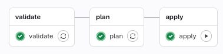
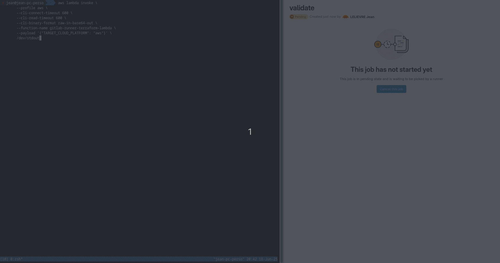

# lambda-gitlab-runner-for-terraform

Update your infrastructure from an AWS Lambda, running as a GitLab runner, ready for CI/CD, executing Terraform commands in an isolated and safe environment.

Works on **AWS** and **Scaleway** cloud providers with an **AWS Lambda** running and credentials stored in **AWS Secrets Manager**.




## Table of Contents

 * Why this project?
 * How it works
 * Installation
    * Build the Lambda runtime
    * Create resources
    * Set up secrets
    * Configure GitLab project
    * Run the script

## Why This Project

Running Terraform commands is a critical step in your development process. Those commands are meant to modify your infrastructure, including your different environments, especially your production.

Such actions should not be runnable directly from developers', SREs', or sysops' workstations. Terraform commands usually require a very high level of privileges, due to their nature of impacting the entire infrastructure; for security reasons, granting individual contributors such high privileges on their own machines is something we want to avoid. Instead, a single minimalistic, isolated, and secured computing unit should handle that specific task.

Main Terraform actions should only be performed when infrastructure changes are requested, hence why we can fairly assume the main Terraform commands (`plan`, `apply`...) to be part of CI/CD pipelines, along with proposed merge requests.

Finally, GitLab Runner could run on a dedicated standalone EC2 instance; however, that would require running a machine all the time, whereas computing resources are only required during the execution of the Terraform command. For cost reasons, we prefer to turn to Lambda functions to host our GitLab Runner service instead.

This project combines:
 * Terraform
 * AWS Lambda
 * AWS Secrets Manager
 * GitLab CI/CD runner

## How It Works

 * Set up privileged credentials in AWS Secrets Manager to be used by the GitLab Runner (`AWS_ACCESS_KEY_ID`, `AWS_SECRET_ACCESS_KEY`, `GITLAB_RUNNER_REGISTRATION_TOKEN`... etc.)
 * Run a local script (with limited privileges) that starts the GitLab runner lambda and keeps it alive
 * Push your Terraform changes and create merge requests; Terraform commands will be run in the Lambda function
 * Verify and apply your changes directly through GitLab CI pipelines

## Installation

You need sufficient privileges to go through the installation step. The simplest way is to use your account **root credentials**. However, keep in mind this is usually a bad practice, and you should disable access afterwards.

### Build the Lambda Runtime

Build the runtime:

```sh
docker build -t ACCOUNT_ID.dkr.ecr.AWS_REGION.amazonaws.com/gitlab-runner-terraform-lambda .
```

Log into your AWS Elastic Container Registry with Docker:

```sh
aws ecr get-login-password | docker login --username AWS --password-stdin ACCOUNT_ID.dkr.ecr.AWS_REGION.amazonaws.com
```

Push the image to your repository:

```sh
docker push ACCOUNT_ID.dkr.ecr.AWS_REGION.amazonaws.com/gitlab-runner-terraform-lambda:latest
```

### Create Resources

Copy the `terraform/` folder content into your infrastructure Terraform repository.

Run `terraform plan|apply`. You may use that [Terraform Devbox Container](https://github.com/jean553/docker-devbox-terraform).

### Set Up Secrets

Set the secrets corresponding to your AWS/Scaleway environment in **AWS Secrets Manager**.

### Configure GitLab Projects

Copy the `gitlab-ci.yml` file into your Terraform repository. Rename it `.gitlab-ci.yml`.

Push the content to your repository.

### Run the Script

Use the new user `gitlab-runner-terraform-lambda-user` with required limited privileges to start the Lambda function from your local machine.

```sh
aws lambda invoke \
    --profile aws \                                            # in case you have several profiles...
    --cli-connect-timeout 600 \                                # the lambda runs ~500 seconds by default, so CLI read timeout is at 600 seconds
    --cli-read-timeout 600 \
    --cli-binary-format raw-in-base64-out \
    --function-name gitlab-runner-terraform-lambda \
    --payload '{"TARGET_CLOUD_PLATFORM": "scaleway"}' \        # use "aws" or "scaleway" (cloud platform where your infrastructure is hosted)
    /dev/stdout
```

Once the lambda is running, the GitLab runner is running as well.

The first time, you may want to enable the runner in your GitLab project (CI/CD settings and Runners).
